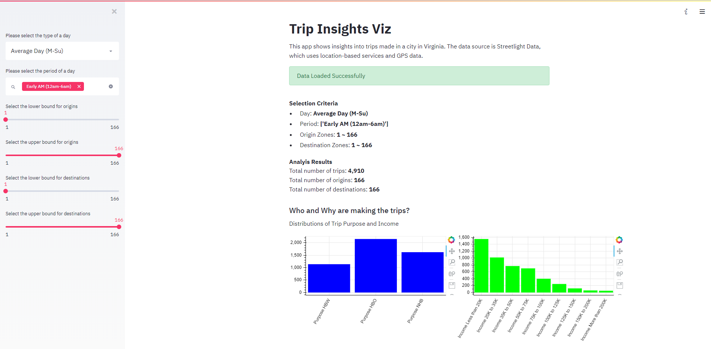

# Streetlight Visualization

## Objective

This project builds a web app to visualize Streetlight Data. The purpose is to show insights into trips made in a city in Virginia. The data source is Streetlight data, which uses location-based services and GPS data. The insights include:

* Who and Why are they making the trips?
* How far and How long are the trips?
* Where do the trips originate within the study area?

## Implementation

The data processing uses `numpy`, `pandas`, and `geopandas`. The plots are created using `bokeh`. The web app uses the `streamlit` package.
